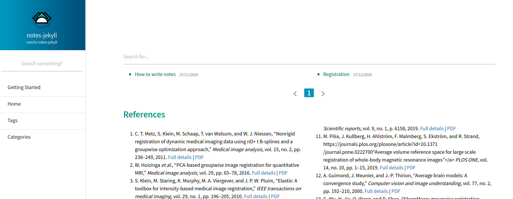

# Notes-jekyll

This is a Jekyll template that is optimized to serve as a note-taking organizational tool.
Specifically, we can easily insert citations into Markdown (you heard that right, 
no LaTeX required here!) and render our notes on GitHub pages. The theme is based on 
[notetheme](https://github.com/dinhanhthi/notetheme) and has added 
[jekyll-scholar](https://github.com/inukshuk/jekyll-scholar) for citation management.



## Getting started

 - [Add papers](#how-to-add-or-view-papers) either manually or with a citation manager
 - [Take notes](#how-to-take-notes) in Markdown, as you typically would
 - [Develop Locally](#develop-locally) using Jekyll natively or via a container
 - [Making changes](#how-to-make-changes) to structure or design of template.
 - [Push to GitHub](#deploy-to-github-pages) to use the GitHub action to automatically deploy the site.

Since the jekyll-scholar plugin doesn't work on GitHub pages, we provide a GitHub action to do it easily.

## How to add or view papers

If you want to interact with your bibliography via a citation manager, you can
easily use something like [BibDesk](https://bibdesk.sourceforge.io/) to keep track of papers.
For example, the references file under [_bibliography](_bibliography) is also 
linked in the root directory, and it could include links to papers in [papers](papers).
By default, we expect the name of the paper pdf to match the name of the citation 
(and BibDesk will do this automatically for you, this is called "AutoFile") and it's
suggested to do a format like `papers/%f{Cite Key}-%u%e`.

## How to take notes

Once you have your papers, you of course want to take notes!
So how can we turn a simple setup of a folder and bibtex file into a nice organizational
structure to take notes and easily cite references? The answer is to take advantage
of Jekyll, and provide a base container and suggested organization to take notes.
You can add references to [build.bib](build.bib), which is linked to the same file
in the [_bibliography](_bibliography) folder. These rederences will render on the front page,
and be available to cite anywhere in the site where you can write markdown.
While we could investigate solutions to run a web server and render a PDF, the simpler
approach of using Markdown will likely be more comfortable for users with different
editor preferences.

## Develop Locally

First, you should clone the repository (and likely fork to your own user account first).
The command below would have "vsoch" replaced with your GitHub username.

```bash
git clone git@github.com:vsoch/notes-jekyll
cd notes-jekyll
```

If you have jekyll installed locally, you can typically then install dependencies with
bundle.

```bash
$ bundle install
```

And then run the development server, which will update with changes:

```bash
bundle exec jekyll serve
```

If not, then you can use a container environment to develop. First, build the container:

```bash
$ docker build -t notes-jekyll .
```

And then run it, making sure to bind the correct directory to where it is expected
in the container, and exposing port 4000.

```bash
$ docker run --rm -v "$PWD:/srv/jekyll" -p 4000:4000 notes-jekyll
Configuration file: /srv/jekyll/_config.yml
            Source: /srv/jekyll
       Destination: /srv/jekyll/_site
 Incremental build: disabled. Enable with --incremental
      Generating... 
       Jekyll Feed: Generating feed for posts
                    done in 2.825 seconds.
 Auto-regeneration: enabled for '/srv/jekyll'
    Server address: http://0.0.0.0:4000/notes-jekyll/
  Server running... press ctrl-c to stop.
```

You should then be able to open your browser to [http://127.0.0.1:4000](http://127.0.0.1:4000).
You can then edit files on your local machine, and the server will refresh with changes.

### Docker to Local

If you use a Docker container at any point and then run the local development server,
you'll likely get a permissions error since the Docker user wrote the `_site` folder.
You can easily fix this by entirely removing the site folder - it will be re-generated.

```bash
rm -rf _site
```

## How to make changes

There are several easy ways to make changes, most of which are represented in the [_config.yml](_config.yml).
For the most part, fields are self explanatory. The following sections might be of particular interest:

### Jekyll scholar

The `scholar` section includes information on how to generate references.

```
scholar:
  style: _bibliography/my-ieee.cls
  bibliography: references.bib
  bibliography_template: bibitem-template
  repository: papers
  details_dir: "paper-details"
  details_layout: "details.html"
# details_permalink: "/notes-jekyll/:details_dir/:key:extension"
# Ensure that details are not printed twice
  details_link: ""
```

#### style
The style for your citations is represented with `style`, above to be `_bibliography/my-ieee.cls`

#### bibliography
The default bibliography file is references.bib, also located in [_bibliography](_bibliography)

#### bibliography_template
The template for each reference (`bibliography_template`) is in [_layouts/bibitem-template.html](_layouts/bibitem-template.html)

#### repository
The folder with physical papers (`repository`), named according to their key, is in [papers](papers).

#### details_layout
The details page for each paper (`details_layout`) should be a template in [_layouts/details.html](_layouts/details.html)

#### details_dir
The path where the paper detail files will be rendered (`details_dir`) is `paper-details`. In practice I found that this was not rendered correctly - it was missing the base url. So I hide the default details render via `details_link` being empty, and add my own in the `bibliography_template`. For this same reason, the default `details_permalink` did not seem to work. Finally, in the documentation it noted that `details_link` should be a key, but in practice I found that it did not work.


For all of the above, this generally means that you can change the location of papers pages, your bibliography, and
how the citations are formatted. There are quite a few other settings, and I found it helpful to look
at the [jekyll-scholar README](https://github.com/inukshuk/jekyll-scholar) and the [defaults.rb](https://github.com/inukshuk/jekyll-scholar/blob/master/lib/jekyll/scholar/defaults.rb) file. Everything is exposed from classes to help
style your entries to ordering and types.

## Deploy to GitHub pages

When you push to the main branch, you will trigger a build defined as a [GitHub workflow](.github/workflows/build.yml)
that will deploy the site to GitHub pages.

For more instructions on how to write references into posts, see [notes-jekyll](https://vsoch.github.io/notes-jekyll/about/)
on GitHub pages.

## LICENSE

This code has inherited the original [LICENSE](LICENSE) that must be preserved
from the repositories where it originates from.

